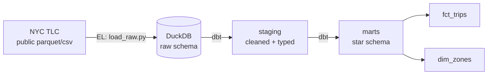
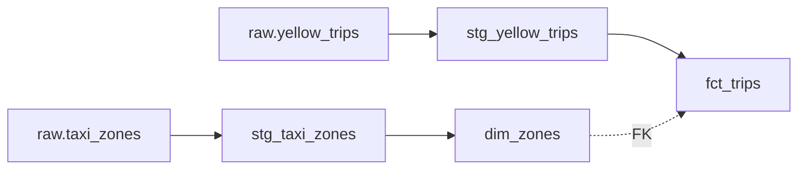

# 🚕 NYC Taxi — ELT Pipeline with dbt & DuckDB

[](https://github.com/ibrahim-yeryaran/nyc-taxi-dbt-pipeline/actions/workflows/ci.yml)

An end-to-end **ELT pipeline** that loads millions of real NYC taxi trips into a
**DuckDB** warehouse and transforms them into a tested, documented **star schema**
using **dbt** — the modern analytics-engineering workflow.

Clone it and run the whole thing with two commands. No cloud account, no API key,
no database server to install.

---

## 🏗️ Architecture



**ELT, not ETL:** raw data is loaded *first* (the cheap "EL" step in Python), then
all transformation logic lives in **dbt** as version-controlled, tested SQL.

---

## 🧬 Data Lineage



> Run `dbt docs generate && dbt docs serve` for the full **interactive** lineage
> graph and auto-generated documentation of every model, column, and test.

---

## 🧰 Tech Stack

| Layer            | Technology                              |
| ---------------- | --------------------------------------- |
| Extract / Load   | Python + DuckDB (`httpfs`)              |
| Warehouse        | [DuckDB](https://duckdb.org/) (embedded) |
| Transformation   | [dbt](https://www.getdbt.com/) (`dbt-duckdb`) |
| Data source      | [NYC TLC Trip Records](https://www.nyc.gov/site/tlc/about/tlc-trip-record-data.page) (public, no key) |

---

## 📁 Project Structure

```
nyc-taxi-dbt-pipeline/
├── extract_load/
│   └── load_raw.py              # EL: public parquet/csv → DuckDB raw schema
├── warehouse/                   # DuckDB file lives here (gitignored)
├── dbt/
│   ├── dbt_project.yml          # dbt project config
│   ├── profiles.yml             # DuckDB connection (portable)
│   └── models/
│       ├── staging/             # cleaned, typed views over raw
│       │   ├── _sources.yml
│       │   ├── stg_yellow_trips.sql
│       │   └── stg_taxi_zones.sql
│       └── marts/               # star schema (tables) + tests
│           ├── _marts.yml
│           ├── fct_trips.sql
│           └── dim_zones.sql
├── requirements.txt
└── .gitignore
```

---

## 🚀 Getting Started

### Prerequisites
- Python 3.9+

### 1. Install dependencies
```bash
python -m venv .venv && source .venv/bin/activate
pip install -r requirements.txt
```

### 2. Extract & Load (raw layer)
```bash
python extract_load/load_raw.py
```
Loads one month of yellow-taxi trips (~3M rows) plus the zone lookup into
`warehouse/nyc_taxi.duckdb`. Add more months in `MONTHS` inside the script.

### 3. Transform & test (dbt)
```bash
cd dbt
DBT_PROFILES_DIR=. dbt build      # runs all models AND all tests
```

### 4. Explore the docs (optional)
```bash
DBT_PROFILES_DIR=. dbt docs generate
DBT_PROFILES_DIR=. dbt docs serve   # opens interactive lineage graph
```

---

## 🌟 The Star Schema

**`fct_trips`** (fact) — one row per trip, with derived metrics:

| Column                  | Description                              |
| ----------------------- | ---------------------------------------- |
| `trip_id`               | Surrogate key (unique, not null)         |
| `pickup_at` / `dropoff_at` | Trip timestamps                       |
| `trip_duration_minutes` | Derived: trip length in minutes          |
| `average_speed_mph`     | Derived: distance ÷ duration             |
| `tip_pct`               | Derived: tip ÷ fare                      |
| `pickup_location_id`    | FK → `dim_zones`                         |
| `dropoff_location_id`   | FK → `dim_zones`                         |

**`dim_zones`** (dimension) — `location_id`, `borough`, `zone_name`, `service_zone`.

---

## ✅ Data Quality Tests

Tests run automatically as part of `dbt build`:

- **`unique` / `not_null`** on every primary key
- **`relationships`** — referential integrity: every pickup/dropoff zone in
  `fct_trips` must exist in `dim_zones`
- **`not_null`** on key measures

```
Done. PASS=11 WARN=0 ERROR=0 SKIP=0 TOTAL=11
```

---

## 📊 Example Insight

A borough-level query over the star schema (`fct_trips` ⨝ `dim_zones`):

| Borough   | Trips      | Avg miles | Avg mph | Avg tip % |
| --------- | ---------- | --------- | ------- | --------- |
| Manhattan | 2,694,979  | 2.89      | 14.0    | 21.4%     |
| Queens    | 281,811    | 12.43     | 29.9    | 20.6%     |
| Brooklyn  | 17,849     | 5.72      | 23.8    | 14.3%     |

*Manhattan = short, slow, high-tip city trips; Queens = long, fast airport runs.*

---

## 🛣️ Possible Extensions

- Load multiple months and add an **incremental** materialization on `fct_trips`.
- Add a `dim_payment_type` and `dim_date` for a richer schema.
- Orchestrate the EL + `dbt build` with **Apache Airflow**
  (see my [European Weather Pipeline](https://github.com/ibrahim-yeryaran/european-weather-pipeline) for the Airflow side).
- Add `dbt-expectations` for advanced data-quality assertions.

---

## 📄 License

MIT — feel free to use this as a learning reference.
